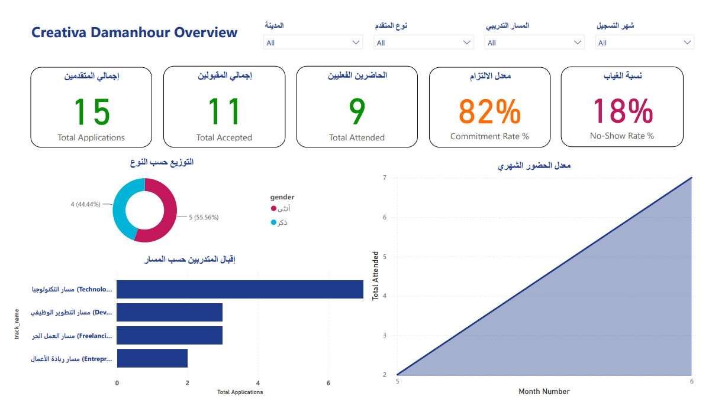
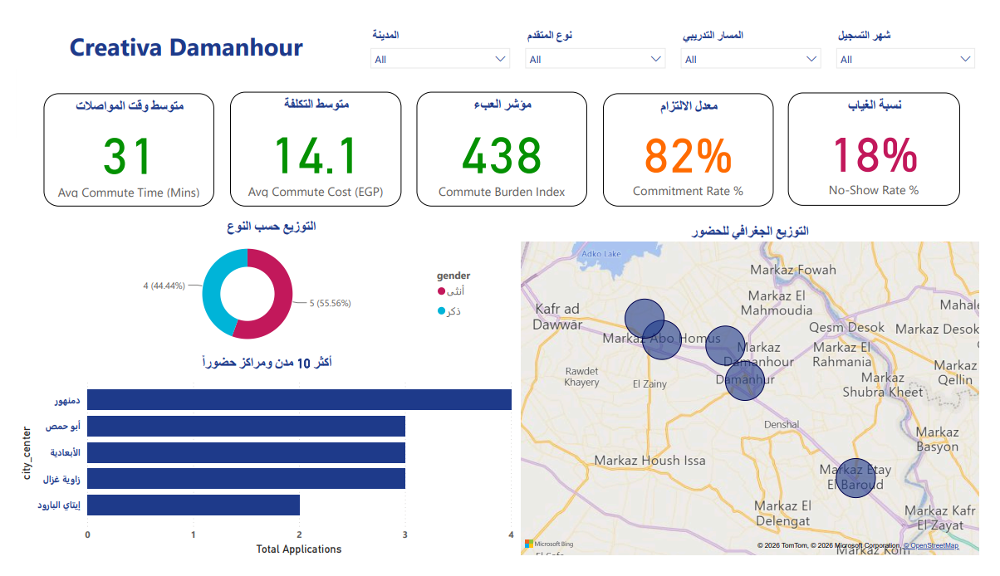
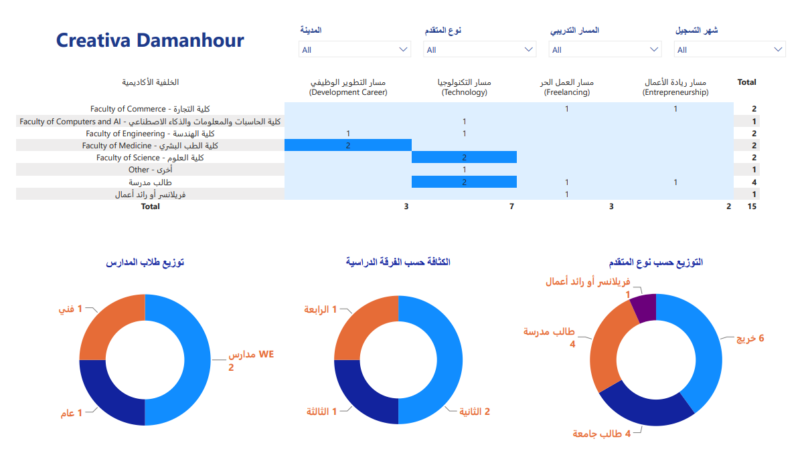
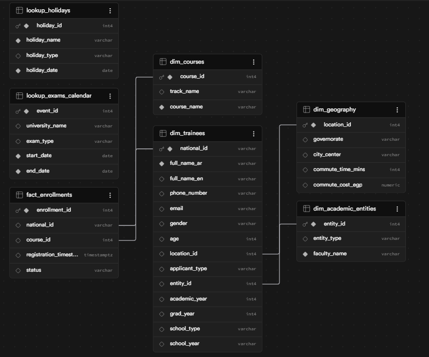
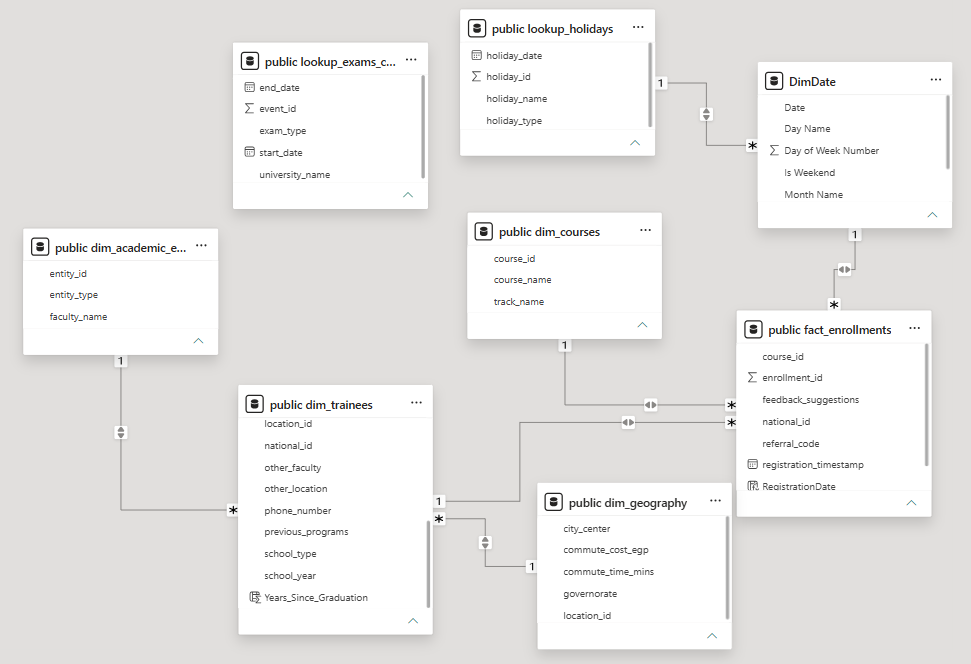

# Creativa Hub Damanhour - Data Intelligence & Business Analytics

This repository contains the interactive Power BI Business Intelligence (BI) dashboard and reporting ecosystem designed to evaluate registration trends, student demographics, operational efficiency, and course satisfaction ratings at **Creativa Hub Damanhour**.

---

## 📸 Dashboard Preview

  
  
<em>Executive Summary Dashboard - Registrations & KPIs</em>

  
   
  
  
  
<em>Participant Demographics & Regional Distribution Panel</em>

  
   
  
  
  
<em>Course Popularity & Track Registration Analysis</em>

  
   
  
  
  
<em>Operational Resource Allocation & Training Schedules</em>

  
   
  
  
  
<em>Student Satisfaction & Trainer Performance Feedback Analysis</em>

  
   
  
  
  
<em>Financial Dashboard - Revenue, Operations, & Resource Utilization</em>

---

## 📌 Project Overview & Role

* **Project Description:** Developed a comprehensive analytics system for Creativa Hub Damanhour. By importing historical student records and operations data, the system outputs clean visual reports evaluating registration growth, training efficacy, resource bottlenecks, and financial outcomes.
* **My Role:** Data Analyst & BI Developer. I established the data cleaning workflows (via Power Query), modeled database relationships, wrote custom DAX measures for key metrics, and designed the interactive frontend layouts.

---

## 📊 Core Dashboards & Analyzed Metrics

1. **Executive Summary Dashboard:** Tracking aggregate registration counts, active courses, total participant numbers, and key operational growth metrics.
2. **Demographics Analysis:** Breaking down student demographics by age, gender, education level, and professional sectors to target future marketing efforts.
3. **Course Popularity & Registrations:** Visualizing course demands to optimize schedule allocation and lecturer hiring.
4. **Operations & Resource Utilization:** Analyzing classroom occupancy rates, timing bottlenecks, and schedule efficiency.
5. **Satisfaction & Feedback Analysis:** Monitoring survey feedback on course content, trainer competence, and facility infrastructure to ensure high quality standards.
6. **Financial Analytics:** Modeling operational costs against registration revenues to assess financial feasibility and project-based margins.

---

## 📂 Repository Contents

* **[Creativa Hub Damanhour.pbix](Creativa%20Hub%20Damanhour.pbix):** The master Power BI Desktop file containing the data models, DAX measures, and interactive dashboard layouts.
* **[Creativa Hub Damanhour.pdf](Creativa%20Hub%20Damanhour.pdf):** Full high-fidelity exported PDF report containing print-ready versions of all 6 dashboards.
* **[Creativa Hub Damanhour_report.pdf](Creativa%20Hub%20Damanhour_report.pdf):** Executive summary document presenting key insights.
